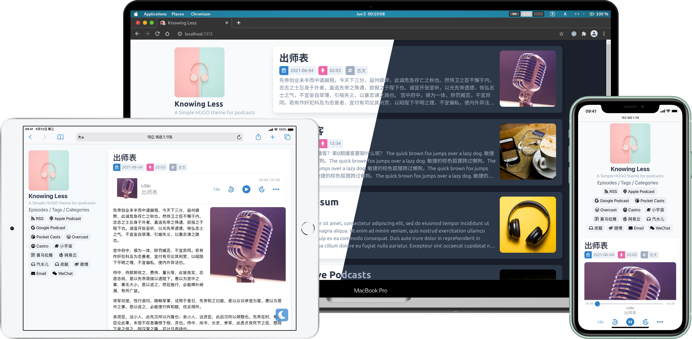

# HUGO Theme Knowing Less

[](https://github.com/LGiki/hugo-theme-knowing-less/blob/master/LICENSE) 

Knowing Less是一款为播客设计的HUGO主题。

[English Version](README.md)

# 截图



# 主题特性

- **响应式**：优雅的响应式双栏布局。
- **专为播客设计**：支持自动从已发布的单集自动生成播客的RSS，并且拥有很多播客相关的设置项。
- **多语言支持**：目前支持简体中文(`zh-CN`)、繁体中文{`zh-TW`}和英文(`en`)，欢迎添加更多翻译。
- **支持夜间模式**

# 安装说明

## 克隆仓库

将这个主题克隆到HUGO站点下的`themes/knowing-less`目录:

```
$ git clone https://github.com/LGiki/hugo-theme-knowing-less themes/knowing-less
```

如果你已经在HUGO根目录建立了一个git仓库，并且不想对这个主题做任何修改，你可以把这个主题作为一个submodule添加到HUGO站点下的`themes/knowing-less`目录：

```
$ git submodule add https://github.com/LGiki/hugo-theme-knowing-less themes/knowing-less
```

## 复制站点配置文件

将`exampleSite`文件夹下的[`config.toml`](exampleSIte/config.toml)文件复制到HUGO网站的根目录：

```
$ cp themes/knowing-less/exampleSite/config.toml config.toml
```

## 编辑站点配置文件

之后根据你的需求编辑`config.toml`站点配置文件即可：

### 菜单设置

配置文件中默认会显示标签、分类等链接，如果你还想在侧边栏中显示更多自定义链接，可以参照以下样例修改：

```toml
[[menu.main]]
  name = "Episodes"
  weight = 20
  identifier = "episodes"
  url = "/episode/"
[[menu.main]]
  name = "Tags"
  weight = 30
  identifier = "tags"
  url = "/tags/"
[[menu.main]]
  name = "Categories"
  weight = 40
  identifier = "categories"
  url = "/categories/"
```

### 链接设置

配置文件中已经提供了很多播客相关的链接配置项，只需要把相应的链接填到`link`字段中即可，如果把`link`字段留空，则对应的链接将不会显示在侧边栏中。

如果你还想添加更多链接，可以参考以下模板填写：

```toml
[[params.links]]
  title = "Apple Podcast"
  fontAwesomeIcon = "fas fa-podcast"
  link = "https://example.org"
  svg = ""
```

链接的图标可以通过`fontAwesome`或`svg`这两个字段来指定（只需填写其中一个字段即可）：

- 如果选择使用`fontAwesome`字段，只需填入`fontawesome`图标的class。例如：

  ```toml
  fontAwesomeIcon = "fas fa-podcast"
  ```

- 如果选择使用`svg`字段，需要先把SVG格式的图片放到`static/icons/`目录中，然后在`svg`字段中指定对应的图标文件。例如：

  ```toml
  svg = "/icons/cosmos.svg"
  ```

这个主题也支持在侧边栏显示微信公众号的二维码，把微信公众号二维码的图片链接填写到`weChatQRCode`字段中。侧边栏就会增加一个“公众号”的链接，当鼠标移动到这个链接上时将会自动显示微信公众号的二维码。

### 播客相关的设置

#### 播客基础信息

- 播客标题

  修改`config.toml`文件中的`title`字段来设置播客标题，这个标题也会作为网站的标题。

- 播客作者

  修改`config.toml`文件中的`author`字段来设置播客的作者，可以设置`name`和`email`两个字段：

  ```toml
  [author]
    name = "LGiki"
    email = "lgiki@example.org"
  ```

- 播客封面图片

  修改`config.toml`文件中的`podcastImage`字段为播客封面图片的链接来设置播客封面图片。

- 播客类别

  根据以下模板设置播客的类别：

  ```toml
  [[params.podcastCategory]]
    title = "Society & Culture"
    subTitle = "Personal Journals"
  [[params.podcastCategory]]
    title = "Society & Culture"
    subTitle = "Relationships"
  [[params.podcastCategory]]
    title = "Society & Culture"
    subTitle = "Documentary"
  ```

#### 播客RSS

这个主题会根据已经发布的单集自动生成播客的RSS，生成的RSS将会自动显示到侧边栏中。

如果你的播客已经有了独立的RSS链接，并且你不想使用这个主题自动生成的播客RSS，你可以在`podcastRSS`字段中填入你播客的RSS链接，这样就会在侧边栏的RSS按钮使用你设定的链接。

## 新建单集

创建新单集的时候，需要使用episode而不是posts：

```
$ hugo new episode/your-title-here.md
```

## 更新主题

如果你对这个主题进行了任何修改，请先commit这些修改。

之后使用`git pull`来拉取最新的commits，如果这个过程中出现了冲突，请手动解决这些冲突：

```
$ cd ./themes/knowing-less
$ git pull
```

# Front Matter

[`archetypes/default.md`](archetypes/default.md)中包含了全部可用的参数。把这个文件复制到HUGO站点根目录下的`archetypes`文件夹中，之后新建的单集就会自动使用这个模板。

播客相关的Front Matter参数如下：

```yaml
coverImage: ""
enclosureURL: ""
enclosureType: ""
enclosureLength: ""
author: ""
# The duration can be either string or integer (in seconds), for example:
# If set duration to 12345 will displayed 03:25:45
# If set duration to "12:34" will displayed 12:34
duration: 0
hiddenFromRSS: false
```

- `coverImage`

  单集封面图片的链接。

- enclosure

  有3个跟enclosure相关的参数：

  - `enclosureURL`: 单集音频文件链接。
  - `enclosureType`: 单集音频文件的[MIME类型](https://developer.mozilla.org/en-US/docs/Web/HTTP/Basics_of_HTTP/MIME_types/Common_types)，例如：`audio/x-m4a`、`audio/mpeg`。
  - `enclosureLength`: 单集音频文件的大小（以字节为单位）。

  这3个参数既用于生成播客的RSS，也用于设定单集页面的播放器参数。

  例如，如果将这3个enclosure相关的参数设置为如下：

  ```yaml
  enclosureURL: "https://example.org/episode1.mp3"
  enclosureType: "audio/mpeg"
  enclosureLength: "123456"
  ```

  将会在RSS中生成如下项：

  ```xml
  <enclosure url="https://example.org/episode1.mp3" type="audio/mpeg" length="123456" />
  ```

- `author`

  单集的作者。

- `duration`

  `duration`字段可以设置为字符串或者是一个数字（以秒为单位），例如：

  - 如果你将`duration`字段设置为`12345`，将会显示为`03:25:45`
  - 如果你将`duration`字段设置为`"12:34"`，将会显示为`"12:34"`

- `hiddenFromRSS`

  如果将这个字段设置为`true`，这个单集将不会出现在RSS中。

# Shortcodes

这个主题提供了`player`这个shortcode用于在文章中插入播客单集播放器，`player`的用法如下：

```
{}
```


# 致谢

- [ananke](https://github.com/theNewDynamic/gohugo-theme-ananke)
- [hugo-theme-even](https://github.com/olOwOlo/hugo-theme-even)
- [github-markdown-css](https://github.com/sindresorhus/github-markdown-css)
- Favicon is made by [Freepik](https://www.freepik.com) from [Flaticon](www.flaticon.com)

